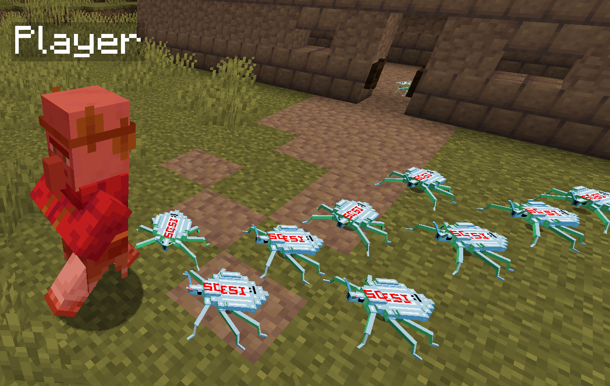
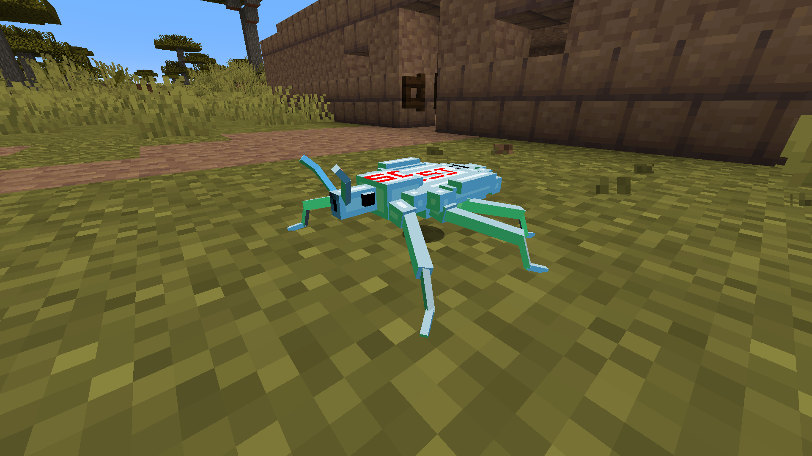
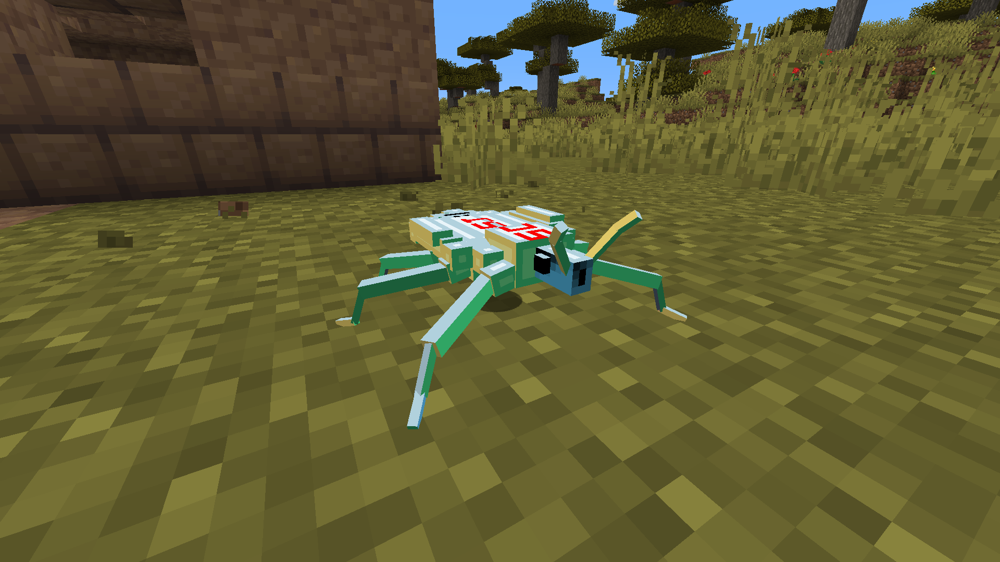
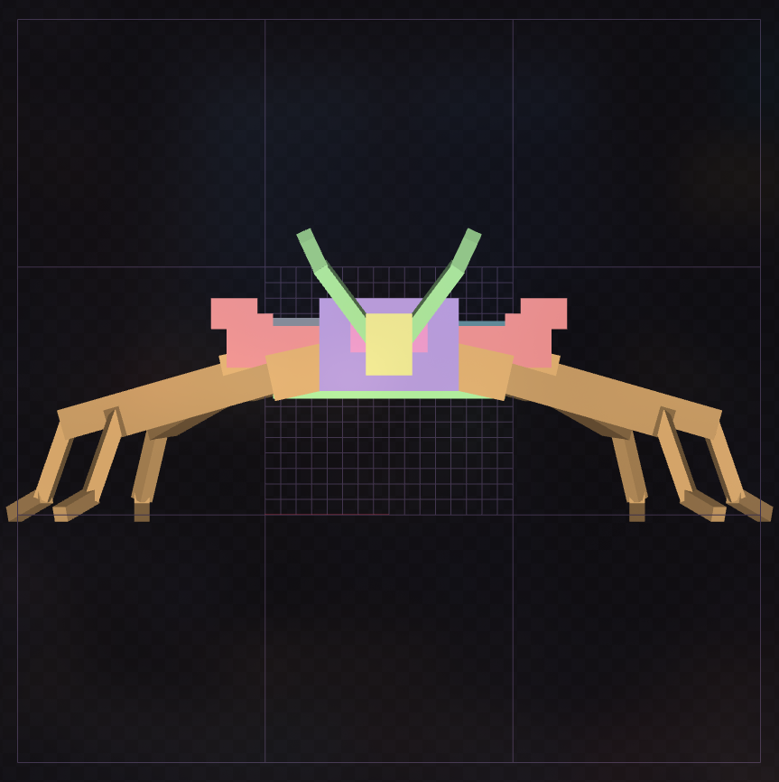
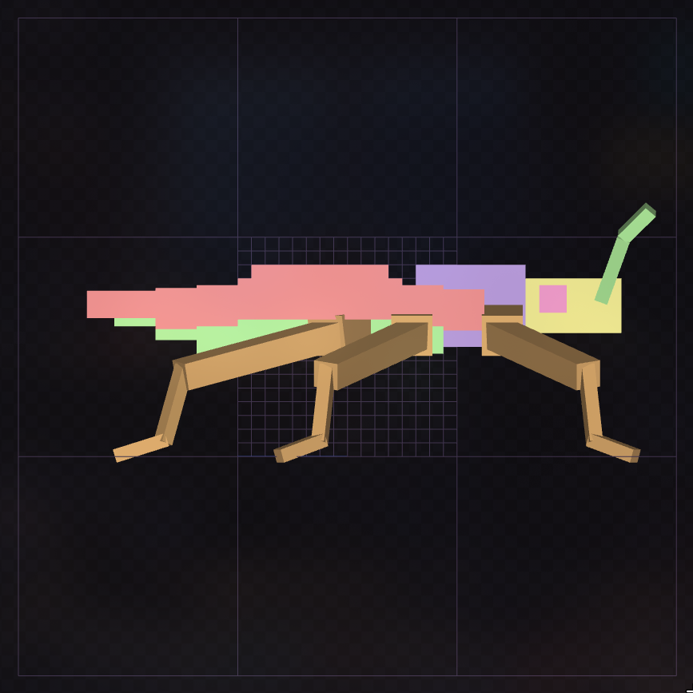
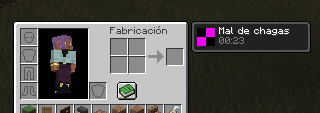

# VINCHUCA MOD

> [!WARNING]
> Este mod aún está en desarrollo. Algunas funciones pueden no estar completas o pueden cambiar en futuras versiones.

En desarrollo para Minecraft 1.21.5 - Forge

<p align="center">
  
</p>

## Descripción

Este mod introduce una nueva entidad hostil: la *vinchuca*. Inspirada en su contraparte real, implementando el mal de Chagas. 

## Descarga
> [!IMPORTANT]
> El mod aún no tiene una versión oficial. Si deseas probarlo, puedes seguir los pasos a continuación para compilar el archivo .jar.

<details>
  <summary>Instrucciones para compilar el mod.</summary>

  ### Requisitos
  - JDK LTS 21.
  - Gradle (opcional, puedes usar el wrapper incluido).
  - Minecraft Forge 1.21.5.

  ### Pasos para construir el mod

  1. Clona el repositorio:
     ```bash
     git clone https://github.com/Stevenjoelrs/ModMinecraft_Vinchucas
     cd ModMinecraft_Vinchucas
     ```

  2. Ejecuta el siguiente comando para la compilación:
     ```bash
     ./gradlew build
     ```

  3. El `.jar` generado estará en `build/libs/`.

  4. Coloca el archivo `.jar` en tu carpeta de mods de Minecraft.

</details>

## Impementaciones
### Vinchuca
<p align="center">
  
  
</p>

#### Modelo
<p align="center">
  
  
  
</p>

### Mal de Chagas
<p align="center">
  
</p>